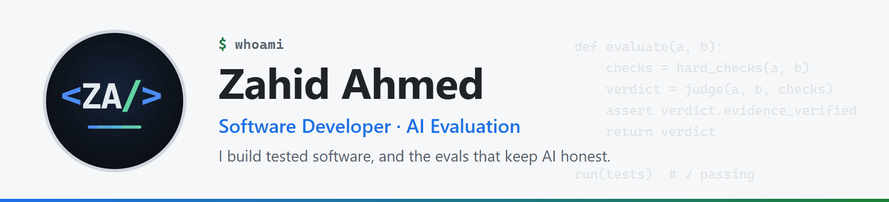
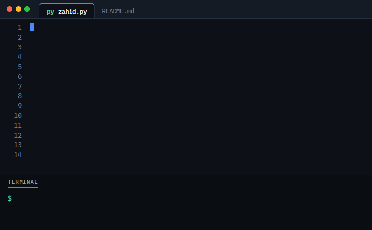
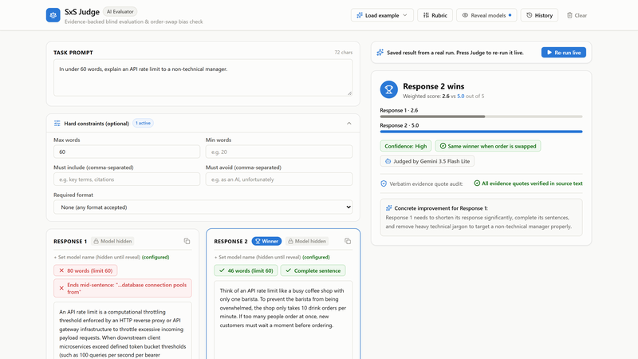
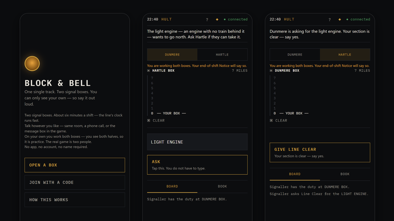
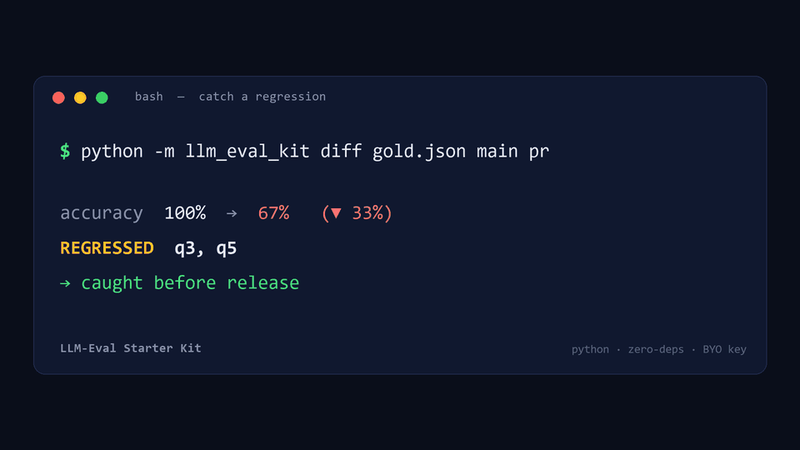
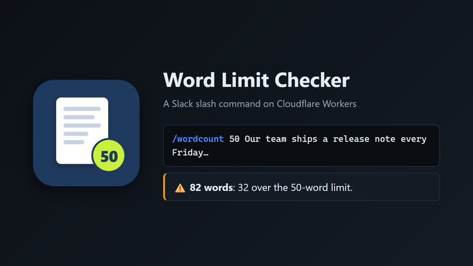

<picture>
  <source media="(prefers-color-scheme: dark)" srcset="assets/header-dark.gif">
  
</picture>

  
  
  
  
  

### Hi, I'm Zahid 👋

Software developer and AI-evaluation specialist in Maharashtra, India. I like work you can check: tests that pass, evals that catch regressions, and verdicts backed by evidence.

- 🔭 **Now:** Handshake AI Fellow, designing software tasks, reference solutions and automated tests that train and evaluate frontier AI coding models
- 🧪 **Before:** evaluated multilingual LLM and speech output at Appen, in English, Hindi, Tamil and Marathi
- 🛠️ **I build with:** Python, C# and .NET, SQL and Oracle PL/SQL, JavaScript on Cloudflare Workers
- 📫 **Open to:** remote software and AI-evaluation work

 

### Featured work

<table>
  <tr>
    <td width="50%" valign="top">
      
      <h4><a href="https://github.com/zahid23saim/sxs-judge">SxS Judge</a></h4>
      Side-by-side grading for AI answers: code-level hard checks, a blind Gemini rubric judge with verified quotes, and an order-swap bias check. 
      React · TypeScript · Gemini API · <a href="https://ai.studio/apps/1216e7fc-6a53-4942-83dd-a9f23c68b5a9?fullscreenApplet=true">Live app</a>
    </td>
    <td width="50%" valign="top">
      
      <h4><a href="https://github.com/zahid23saim/block-and-bell">Block &amp; Bell</a></h4>
      A real-time railway-signalling game for 2 to 4 players where each player can only see their own box. Every shift is solved before it's printed. 
      JavaScript · Cloudflare Workers · Durable Objects · <a href="https://block-and-bell.zahid23saim.workers.dev">Play</a>
    </td>
  </tr>
  <tr>
    <td width="50%" valign="top">
      
      <h4><a href="https://github.com/zahid23saim/llm-eval-harness">llm-eval-harness</a></h4>
      A dependency-free harness that scores LLM answers against a gold set, with per-question match rules, and fails CI when answers regress. 
      Python · pytest · <a href="https://zahid23saim.github.io/demo.html">Demo</a>
    </td>
    <td width="50%" valign="top">
      
      <h4><a href="https://github.com/zahid23saim/word-limit-checker">Word Limit Checker</a></h4>
      A Slack slash command that checks a draft against a word limit. Least privilege: only the <code>commands</code> scope, and every request is signature-verified. 
      JavaScript · Slack API · Cloudflare Workers
    </td>
  </tr>
</table>

**Also:** [LLM Picker](https://share.gemini.google/WZ9XPSxU4x1G), an interactive chart for choosing a model by accuracy, cost and speed · [aspnet-minimal-api](https://github.com/zahid23saim/aspnet-minimal-api), a tested .NET 8 API · [plsql-bulk-examples](https://github.com/zahid23saim/plsql-bulk-examples), row-by-row loads made fast with `BULK COLLECT` and `FORALL`

### Tech

Also: SQL and Oracle PL/SQL · pytest · xUnit · Slack API · Gemini API · LLM evaluation · factuality and STEM auditing

### Latest writing

<!-- BLOG-POST-LIST:START -->
- [Catch LLM regressions before your users do — a tiny CI gate for LLM output](https://dev.to/zahid23saim/catch-llm-regressions-before-your-users-do-a-tiny-ci-gate-for-llm-output-8bg)
- [Building a Tested ASP.NET Core Minimal API in One File](https://dev.to/zahid23saim/building-a-tested-aspnet-core-minimal-api-in-one-file-20c1)
- [What I Learned Evaluating LLMs Across Four Languages](https://dev.to/zahid23saim/what-i-learned-evaluating-llms-across-four-languages-956)
- [Speeding Up a Slow PL/SQL Routine with BULK COLLECT and FORALL](https://dev.to/zahid23saim/speeding-up-a-slow-plsql-routine-with-bulk-collect-and-forall-5c0l)
- [Automating LLM Answer Evaluation with a Small Python Scoring Script](https://dev.to/zahid23saim/automating-llm-answer-evaluation-with-a-small-python-scoring-script-4f8o)
<!-- BLOG-POST-LIST:END -->

🌐 English · Hindi · Tamil · Marathi
